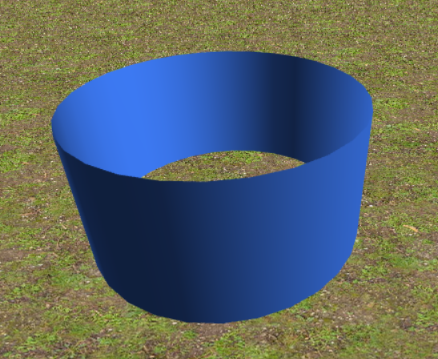
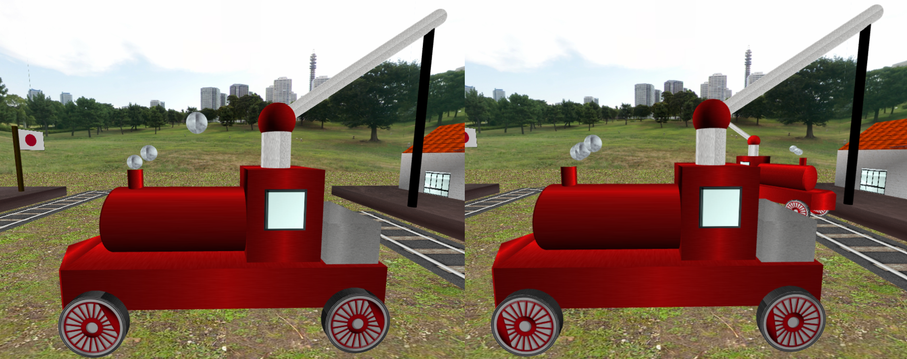

# CGRA 2021/2022

## Group T01G07
Pedro Silva - up201907523

Claudio Savelli - up202111375

## Project Notes
The only thing not implemented was the Polyline link correction. All other extras were implemented.

## Screenshots
### Track

### Cylinder

### Window

### Earth

### Train

### Cube map

### Picking up wood with crane

### Dropping wood with crane

### Train with textures

### Station

### Full scene

### Wheel rotation

### Smoke

### Smooth train rotation
