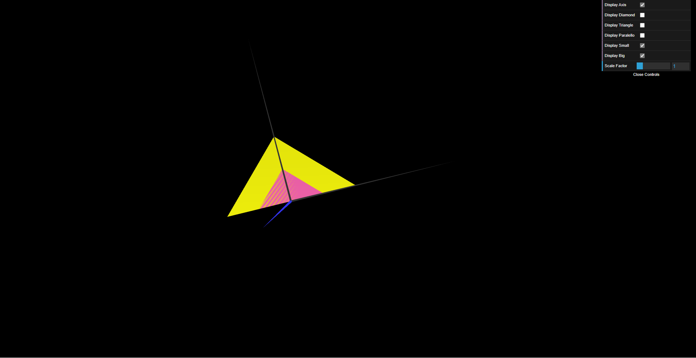

# CGRA 2021/2022

## Group T07G01

## TP 1 Notes

- In exercise 1 we had no difficulties. We observed that to draw 2D shapes we set to define their vertices' coordinates and then set
the vertex index order. To make a shape visible from both sides we just need to repeat the indices but reverse their order.

- In exercise 2 we had no difficulties. The bigger triangle is just the smaller triangle but with a scaling factor of 2 applied on both axis.

